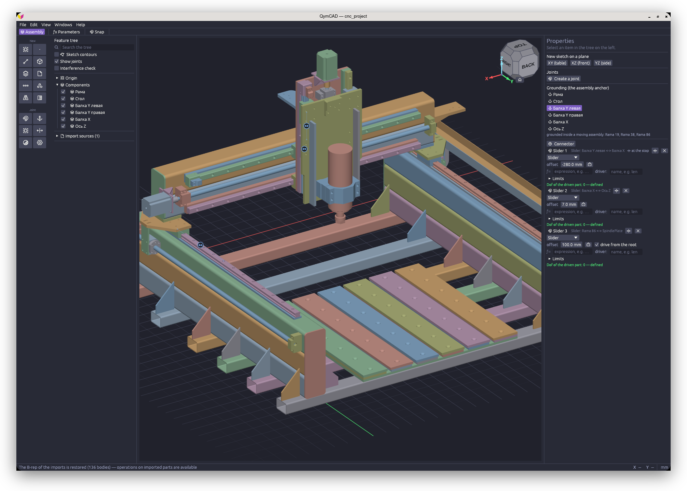

<div align="center">


# QymCAD

**B-rep ядросындағы параметрлік ассоциативті CAD**

Эскиз → бөлшек → жинақ. Бір бағдарлама, бір жоба файлы, бұлтсыз және жазылымсыз.

[cad.qymis.tech](https://cad.qymis.tech)

[](https://github.com/QymIs-Tech/QymCAD/actions/workflows/checks.yml)
[](https://github.com/QymIs-Tech/QymCAD/releases)
[](LICENSE)
<br>
[](https://github.com/QymIs-Tech/QymCAD/releases)
[](https://github.com/QymIs-Tech/QymCAD/releases)
[](https://github.com/QymIs-Tech/QymCAD/releases)

[English](README.md) | [Русский](README.ru.md) | [Українська](README.uk.md) | **Қазақша**



</div>

## Бұл не

QymCAD — механикалық бөлшектер мен жинақтарға арналған жұмыс үстелі CAD-ы: корпустар, кронштейндер,
механизмдер, басып шығарылатын және фрезерленетін бұйымдар.

Эскиз созу, айналдыру немесе траектория бойымен созу арқылы денеге айналады; денеге тесіктер,
дөңгелектеулер, қабық, массивтер қосылады. Бөлшектер қосылыстар арқылы жинаққа жиналады — айналмалы,
сырғымалы, қатаң. Модель параметрлік: кез келген операциядағы өлшемді өзгертсеңіз, тізбекте одан
төменгінің бәрі, жинақты қоса, қайта құрылады.

Геометрия дәл және тұтас (B-rep), оны [OpenCASCADE](https://dev.opencascade.org/) ядросы есептейді —
FreeCAD жұмыс істейтін сол ядро. Сондықтан торлардың орнына дәл беттер, дұрыс дөңгелектеулер және
басқа CAD жүйелерімен STEP арқылы алмасу.

Интерфейс қазақ, ағылшын, орыс және украин тілдерінде қолжетімді.

## Күйі

Әзірлеу нұсқасы. Бағдарлама жұмыс істейді және нақты бөлшектерге жарамды, бірақ күн сайын жаңарып
отырады.

- **Құжат форматы кері үйлесімділіксіз өзгереді.** Ертерек нұсқада сақталған файл ашылмауы мүмкін.
  Мұндай файлдарға `convert_qcad.py` скрипті бар (төменде қараңыз).
- **СББ (CAM) модулі жұмыс істемейді.** Баптауларда «Өңдеу» (CAM) қойындысының белгішесі бар, бірақ
  оның артындағысы болашаққа арналған негіз: кодтың бір бөлігі ертеректегі нұсқадан қалған және
  қолдау көрсетілмейді. Модуль тұрақты альфада оралады.
- **macOS жинағында Apple қолтаңбасы жоқ.** macOS жүктелген бағдарламаны карантинге белгілеп, оны
  зақымдалған деп ашудан бас тартады — бұл олай емес. Белгі бір рет, бір командамен алынады, ол
  мұрағат ішіндегі нұсқаулықта қадам бойынша жазылған. Тек Apple Silicon; Intel жинағы жоқ.

## Мүмкіндіктері

**Эскиз.** Сызықтар, доғалар, шеңберлер, эллипстер, сплайндар, көпбұрыштар, ойықтар, мәтін.
Байланыстар мен өлшемдер бірге шешіледі; өлшемдер параметрлік (`w/2`, `sin(a)`). Көмекші геометрия
және дене қырларын эскизге проекциялау бар.

**Бөлшектер.** Созу, айналдыру, траектория бойымен созу, лофт, дөңгелектеу (соның ішінде төбелерде
берілетін айнымалы радиус), фаска, қабық, еңіс, тесіктер (қарапайым, цекілеу, зенкерлеу), қалыңдату,
жамау, тігу, қию, беттер мен денені бөлу, бетті көшіру және жылжыту, сызықтық және дөңгелек
массивтер, айна, буль операциялары, және примитивтер: параллелепипед, цилиндр, сфера, конус, тор,
призма. Бұрандалар жүгірісі бар нақты бұрандалы профильмен құрылады.

**Жинақтар.** Бөлшектер мен ішкі жинақтар, қосылыстар (қатаң, айналмалы, сырғымалы, цилиндрлік,
жазық, шарлы, саусақ-ойық, параллельдік), шектер мен жетектер, еркіндік дәрежелері, қиылысуды
тексеру. Эскизді көрші бөлшектің бетіне ассоциативті сілтеме ретінде қоюға болады: көршіні
өзгертсеңіз, тәуелді бөлшек қайта құрылады.

**Алмасу.** STEP (импорт және экспорт), STL (импорт және экспорт), DXF және SVG (эскиздерді импорт
және экспорт). Бүкіл жобаны да, ағаштан таңдалған жеке бөлшекті не ішкі жинақты да жазуға болады.

## Орнату

Жинақтар [Releases](https://github.com/QymIs-Tech/QymCAD/releases) бөлімінде. Қосымша кітапханалар қажет емес: OpenCASCADE және тәуелділіктер пакеттің ішінде.

<details>
<summary><b>Windows (10 / 11 x64)</b></summary>

- **Портативті нұсқа**: `qymcad-win64.zip` жүктеп алып, кез келген жерге ашып, `qymcad.exe` іске қосыңыз.
- **MSI орнатқышы**: жүйеге орнату үшін `qymcad-*-x64.msi` жүктеп алып, іске қосыңыз.
- **winget**:
  ```powershell
  winget install QymIsTech.QymCAD
  ```

</details>

<details>
<summary><b>Linux (x86_64)</b></summary>

glibc 2.35 не жаңарағы керек (Ubuntu 22.04+, Debian 12+, Fedora 36+, Arch Linux).

- **AppImage** (бір файл):
  ```bash
  chmod +x qymcad-*.AppImage
  ./qymcad-*.AppImage
  ```
- **Arch Linux (AUR)**:
  ```bash
  yay -S qymcad-bin
  ```

</details>

<details>
<summary><b>macOS 12+ (Apple Silicon)</b></summary>

`qymcad-*-macos-arm64.zip` файлын жүктеп алып, ашыңыз. Жинақта Apple қолтаңбасы жоқ, сондықтан бірінші іске қосу алдында Терминалда карантин белгісін бір рет алып тастау керек:

```bash
xattr -cr QymCAD.app
```

Содан соң `QymCAD.app` кәдімгідей екі рет басу арқылы ашыңыз.

*Ескертпе: тек Apple Silicon үшін (M1/M2/M3/M4); Intel жинағы жоқ.*

</details>

## Анықтама

Кірістірілген анықтама **F1** пернесімен ашылады. Суреттері бар мақалалар [`docs/help`](docs/help)
қалтасында.

## Жоба файлдары

Құжат `.qcad` ретінде сақталады. Формат үйлесімділік қабатынсыз тікелей өзгереді; ертерек
нұсқалардың құжаттары бөлек скриптпен жаңартылады:

```bash
python3 convert_qcad.py part.qcad    # файлды орнында түрлендіреді, жанына part.qcad.bak қалдырады
```

Скрипт құжатты кез келген ертерек нұсқадан бір өтуде ағымдағысына жеткізеді және идемпотентті.

## Бастапқы кодтан жинау

Linux — `just pkg-linux`, Docker керек. Windows — MSVC, ядро бастапқы кодтан жиналады. macOS — ядро
де бастапқы кодтан, содан соң `packaging/macos/bundle.sh`. Толығырақ:
[`packaging/README.md`](packaging/README.md).

## Әзірлеуге қатысу

Біз кез келген үлесті қуана қабылдаймыз — код, құжаттама, жаңа аудармалар және қателер туралы есептер. Бастау үшін [үлес қосу нұсқаулығын](CONTRIBUTING.md) қарап шығып, [good first issue](https://github.com/QymIs-Tech/QymCAD/issues?q=is%3Aissue+is%3Aopen+label%3A%22good+first+issue%22) белгісі бар тапсырманы таңдаңыз.

## Үлес қосушылар

<a href="https://github.com/QymIs-Tech/QymCAD/graphs/contributors">
  
</a>

## Жұлдыздар тарихы

<a href="https://star-history.com/#QymIs-Tech/QymCAD&Date">
 <picture>
   <source media="(prefers-color-scheme: dark)" srcset="https://api.star-history.com/svg?repos=QymIs-Tech/QymCAD&type=Date&theme=dark" />
   <source media="(prefers-color-scheme: light)" srcset="https://api.star-history.com/svg?repos=QymIs-Tech/QymCAD&type=Date" />
   
 </picture>
</a>

## Лицензия

Код [AGPL-3.0-or-later](LICENSE) лицензиясымен таратылады: форк пен кез келген туынды жинақ ашық
бастапқы кодты сол лицензияда қалады.

OpenCASCADE ядросы ерекшелігі бар LGPL-2.1 лицензиясымен беріледі және динамикалық түрде
байланыстырылады; қаріптер мен белгішелер өз лицензияларымен беріледі. Мұның бәрі
[THIRD-PARTY-NOTICES.md](THIRD-PARTY-NOTICES.md) файлында тізілген, ол файл әр пакетте бағдарламаның
жанына қойылады.

---

**QymIs Tech** шеберханасы — [qymis.tech](https://qymis.tech). Авторы: Денис Казаченков.
