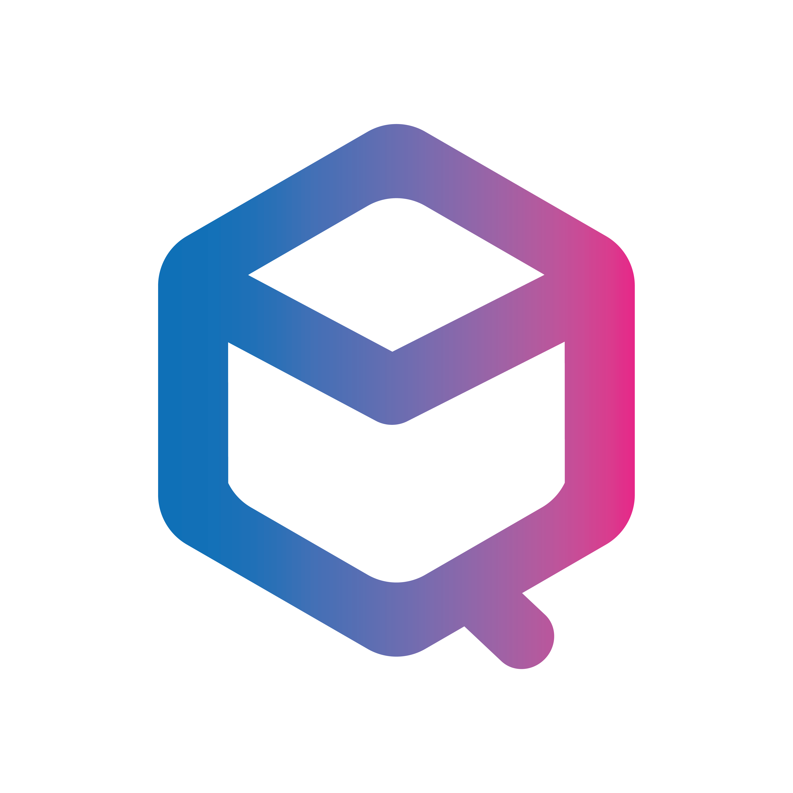
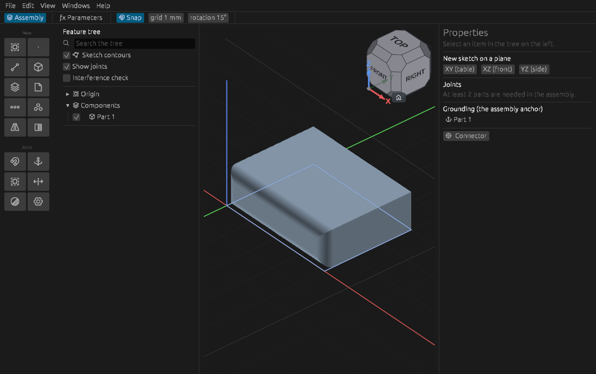

<div align="center">



# QymCAD

**Параметрический ассоциативный CAD с ядром B-rep**

Эскиз → деталь → сборка. Одна программа, один файл проекта, без облака и подписки.

[cad.qymis.tech](https://cad.qymis.tech)

[English](README.md) · **Русский**



</div>

## Что это

QymCAD — настольный САПР для механических деталей и сборок: корпусов, кронштейнов, механизмов,
печатных и фрезерованных изделий.

Эскиз превращается в тело выдавливанием, оборотом или sweep'ом; тело дополняется отверстиями,
скруглениями, оболочкой, массивами. Детали собираются в узел сопряжениями — вращательными, ползунами,
жёсткими. Модель параметрическая: изменение размера в любой операции перестраивает всё, что стоит
ниже по ленте, включая сборку.

Геометрия точная, объёмная (B-rep) на ядре [OpenCASCADE](https://dev.opencascade.org/) — том же, на
котором работает FreeCAD. Отсюда точные поверхности вместо сеток, корректные скругления и обмен
через STEP с другими САПР.

Интерфейс на русском и английском.

## Состояние

Версия для разработки. Программа работает и пригодна для реальных деталей, но обновляется ежедневно.

- **Формат документа меняется без обратной совместимости.** Файл, сохранённый в прежней версии, может
  не открыться. Для таких файлов есть скрипт `convert_qcad.py` (см. ниже).
- **Модуль ЧПУ (CAM) не работает.** В настройках он включается галкой «Вкладка „Обработка“ (CAM)», но
  это задел на будущее: часть кода досталась от прежней версии и не поддерживается. Модуль вернётся к
  стабильной альфе.
- **Сборок под macOS нет.** Поддерживаются Windows и Linux.

## Возможности

**Эскиз.** Линии, дуги, окружности, эллипсы, сплайны, многоугольники, пазы, текст. Связи и размеры
решаются совместно; размеры параметрические (`w/2`, `sin(a)`). Есть вспомогательная геометрия и
проекция рёбер тела в эскиз.

**Деталь.** Выдавливание, оборот, sweep, лофт, скругление (в том числе переменного радиуса по
вершинам), фаска, оболочка, уклон, отверстия (простые, цековка, зенковка), утолщение, заплатка,
сшивка, обрезка, деление граней и тела, копирование и толкание грани, массивы линейные и круговые,
зеркало, булевы операции. Есть примитивы: параллелепипед, цилиндр, сфера, конус, тор, призма.
Резьба строится настоящим винтовым профилем со сбегами.

**Сборка.** Детали и подсборки, сопряжения (жёсткое, вращательное, ползун, цилиндрическое, плоское,
шаровое, штифт в пазу, параллельность), ограничения и приводы, степени свободы, проверка
интерференции. Эскиз строится на грани соседней детали как ассоциативная ссылка: изменение соседней
детали перестраивает зависимую.

**Обмен.** STEP (импорт и вывод), STL (импорт и вывод), DXF и SVG (импорт и вывод эскизов).
Вывести можно как весь проект, так и отдельную деталь или подсборку из дерева.

## Установка

Сборки — в разделе [Releases](../../releases). Дополнительные библиотеки не требуются: OpenCASCADE и
зависимости входят в пакет.

**Windows 10/11 x64** — `qymcad-win64.zip`. Распаковать и запустить `qymcad.exe`.

**Linux** — `qymcad-*.AppImage`, один файл. Требуется glibc 2.35 или новее: Ubuntu 22.04+,
Debian 12+, Fedora 36+, Arch.

```bash
chmod +x qymcad-*.AppImage
./qymcad-*.AppImage
```

## Справка

Встроенная справка вызывается клавишей **F1**. Статьи с иллюстрациями — в [`docs/help`](docs/help).

## Файлы проекта

Документ сохраняется в `.qcad`. Формат меняется напрямую, без слоя совместимости; документы прежних
версий переводит отдельный скрипт:

```bash
python3 convert_qcad.py part.qcad    # переводит на месте, рядом остаётся part.qcad.bak
```

Скрипт приводит документ любой прежней версии к текущей за один проход и идемпотентен.

## Сборка из исходников

Linux — `just pkg-linux`, требуется Docker. Windows — MSYS2/MINGW64. Подробности:
[`packaging/README.md`](packaging/README.md).

## Участие в разработке

См. [CONTRIBUTING.ru.md](CONTRIBUTING.ru.md).

## Лицензия

Код распространяется под [AGPL-3.0-or-later](LICENSE): форк и любая производная сборка остаются под
той же лицензией с открытыми исходниками.

Ядро OpenCASCADE идёт под LGPL-2.1 с исключением и линкуется динамически; шрифты и значки — под
своими лицензиями. Всё это перечислено в [THIRD-PARTY-NOTICES.md](THIRD-PARTY-NOTICES.md), и файл
кладётся рядом с программой в каждой сборке.

---

Мастерская **QymIs Tech** — [qymis.tech](https://qymis.tech). Автор: Денис Казаченков.
